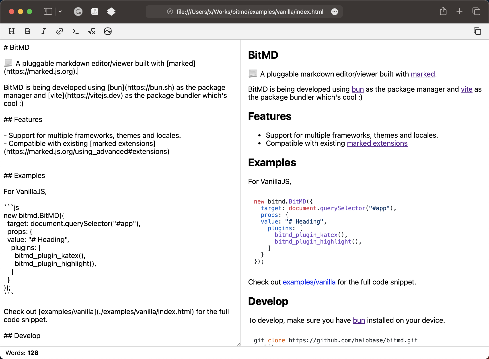

# BitMD

📃 A pluggable markdown editor/viewer built with [marked](https://marked.js.org).



BitMD is being developed using [bun](https://bun.sh) as the package manager and [vite](https://vitejs.dev) as the package bundler which's cool :)

## Features

- Support for multiple frameworks, themes and locales.
- Compatible with existing [marked extensions](https://marked.js.org/using_advanced#extensions)


## Examples

For VanillaJS,

```js
new bitmd.BitMD({
  target: document.querySelector("#app"),
  props: {
  value: "# Heading",
    plugins: [
      bitmd_plugin_katex(),
      bitmd_plugin_highlight(),
    ]
  }
});
```

Check out [examples/vanilla](./examples/vanilla/index.html) for the full code snippet. 

## Plugins & Bindings

Here are plugins or bindings finished or being planned.

- [x] [plugin-gfm](./packages/plugin-gfm/) - GitHub flavored markdown
- [x] [plugin-image](./packages/plugin-image/) - Image upload and insertion
- [x] [plugin-katex](./packages/plugin-katex/) - LaTeX math formulas
- [x] [plugin-highlight](./packages/plugin-highlight/) - Code highlighting
- [ ] [plugin-mermaid](./packages/plugin-mermaid/) - Mermaid graghs and charts
- [ ] [react](./packages/react/) - React binding of BitMD
- [ ] [vue](./packages/vue/) - Vue binding of BitMD

## Develop

To develop, make sure you have [bun](https://bun.sh) installed on your device.

```bash
git clone https://github.com/mivinci/bitmd.git
cd bitmd
bun i
```

## Credits

- [marked](https://marked.js.org)
- [bytemd](https://bytemd.js.org)

## License

BitMD is MIT licensed.

##

Have fun :)
